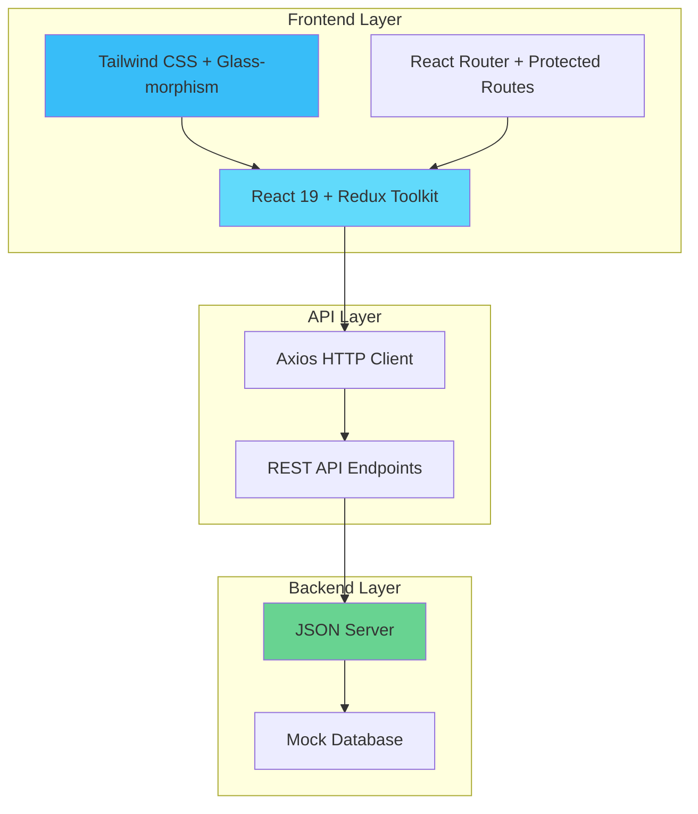

# 🛍️ LUMINA - Modern E-commerce Platform

<div align="center">

<!--  -->

**A contemporary full-stack e-commerce platform featuring React, Redux Toolkit, and modern glass-morphism design**

[](https://reactjs.org/)
[](https://redux-toolkit.js.org/)
[](https://tailwindcss.com/)
[](https://github.com/typicode/json-server)
[](https://vitejs.dev/)
[](LICENSE)

[🚀 Live Demo](#) | [📖 Documentation](#-table-of-contents) | [🐛 Report Bug](#-contributing) | [💡 Request Feature](#-contributing) | [⭐ Star this repo](#)

</div>

---

## 🎯 **What is LUMINA?**

LUMINA is a **modern, e-commerce platform** that showcases contemporary web development practices. Built with the latest React ecosystem and featuring a stunning glass-morphism design, it provides a complete shopping experience with robust admin capabilities.

> 💡 **Perfect for**: Learning modern React patterns, understanding Redux state management, exploring contemporary UI/UX design, and building production-ready e-commerce applications.

---

## 📋 Table of Contents

- [🌟 Project Overview](#-project-overview)
- [✨ Key Features](#-key-features)
- [🏗️ Architecture](#️-architecture)
- [🛠️ Technology Stack](#️-technology-stack)
- [🚀 Quick Start Guide](#-quick-start-guide)
- [📁 Project Structure](#-project-structure)
- [🎨 Design System](#-design-system)
- [🔐 Authentication & Security](#-authentication--security)
- [🛒 E-commerce Features](#-e-commerce-features)
- [📱 Responsive Design](#-responsive-design)
- [🔧 Configuration](#-configuration)
- [🚀 Deployment](#-deployment)
- [🧪 Testing](#-testing)
- [📈 Performance](#-performance)
- [🤝 Contributing](#-contributing)
- [📚 Learning Resources](#-learning-resources)
- [🆘 Troubleshooting](#-troubleshooting)
- [📄 License](#-license)
- [🙏 Acknowledgments](#-acknowledgments)

---

## 🌟 Project Overview

### 🎯 **Mission Statement**
To create a modern, accessible, and performant e-commerce platform that demonstrates best practices in React development, state management, and contemporary UI/UX design.

### 🌐 **Full-Stack Architecture**



### 🎨 **Design Philosophy**

| Principle | Implementation | Benefit |
|-----------|----------------|---------|
| 🎨 **Glass-morphism** | Backdrop blur + transparency | Modern, elegant appearance |
| 🌈 **Gradient Themes** | Blue to purple color schemes | Visual consistency |
| ⚡ **Micro-interactions** | Hover effects + animations | Enhanced user experience |
| 📱 **Mobile-first** | Responsive design patterns | Universal accessibility |
| 🔍 **Accessibility** | WCAG compliant components | Inclusive design |

---

## ✨ Key Features

<details>
<summary>🛍️ <strong>E-commerce Functionality</strong> (Click to expand)</summary>

### Customer Features
- 🏪 **Product Catalog**: Browse products with advanced filtering and search
- 🛒 **Shopping Cart**: Add, update, remove items with real-time calculations
- 👤 **User Profiles**: Personal account management and order history
- 🔐 **Secure Authentication**: Login/register with form validation
- 📱 **Responsive Design**: Seamless experience across all devices
- 🔍 **Product Search**: Find products quickly with smart search
- ⭐ **Product Reviews**: Rate and review products (coming soon)
- ⚡ **Lazy Loading**: Components are loaded only when needed for improved performance
- 🔄 **Pagination with Infinite Scroll**: Products load automatically as you scroll for a smooth browsing experience

### Admin Features
- 📊 **Dashboard**: Comprehensive admin control panel
- 📦 **Product Management**: Full CRUD operations for products
- 👥 **User Management**: Monitor and manage user accounts
- 📈 **Analytics**: Sales and user behavior insights (coming soon)
- 🏷️ **Category Management**: Organize products efficiently
- 🎨 **Content Management**: Update site content and images

</details>

<details>
<summary>🎨 <strong>Modern UI/UX Design</strong> (Click to expand)</summary>

### Visual Design
- 🌟 **Glass-morphism Effects**: Contemporary backdrop blur and transparency
- 🌈 **Gradient Themes**: Beautiful blue to purple color schemes
- ✨ **Smooth Animations**: Hover effects, transitions, and micro-interactions
- 📝 **Typography**: Enhanced font weights and spacing for readability
- 🎯 **Visual Hierarchy**: Improved contrast and sizing
- 🃏 **Modern Cards**: Rounded corners, shadows, and professional layouts

### User Experience
- ⚡ **Fast Loading**: Optimized performance with Vite
- 🔄 **Real-time Updates**: Instant feedback for user actions
- 📱 **Mobile-first**: Designed for mobile, enhanced for desktop
- ♿ **Accessibility**: WCAG compliant design patterns
- 🎮 **Interactive Elements**: Engaging hover states and animations
- 🧭 **Intuitive Navigation**: Clear and consistent navigation patterns

</details>

<details>
<summary>🔧 <strong>Technical Features</strong> (Click to expand)</summary>

### Frontend Architecture
- ⚛️ **React 19**: Latest React features and optimizations
- 🏪 **Redux Toolkit**: Efficient state management with RTK
- 🎨 **Tailwind CSS**: Utility-first styling approach
- 🚀 **Vite**: Lightning-fast development and build tool
- 🛣️ **React Router**: Client-side routing with protected routes
- 📋 **React Hook Form**: Performant form handling and validation

### Backend & API
- 🗄️ **JSON Server**: RESTful API with mock database
- 🔗 **Axios**: HTTP client for API communication
- 🔐 **Authentication**: Secure user session management
- 📊 **Data Persistence**: JSON-based data storage
- 🔄 **Real-time Sync**: Automatic data synchronization

</details>

---

## 🏗️ Architecture

### 🌐 **System Architecture Overview**

```
┌─────────────────────────────────────────────────────────────┐
│                    LUMINA E-COMMERCE PLATFORM               │
├─────────────────────────────────────────────────────────────┤
│  Frontend (Port 5173)          │  Backend (Port 3000)       │
│  ┌─────────────────────────┐   │  ┌─────────────────────────┐│
│  │     React Application   │   │  │     JSON Server API     ││
│  │  ┌─────────────────────┐│   │  │  ┌─────────────────────┐││
│  │  │   UI Components     ││   │  │  │   REST Endpoints    │││
│  │  │  - NavBar           ││   │  │  │  - /products        │││
│  │  │  - ProductCard      ││   │  │  │  - /users           │││
│  │  │  - CartCard         ││   │  │  │  - /carts           │││
│  │  │  - Forms            ││   │  │  └─────────────────────┘││
│  │  └─────────────────────┘│   │  │                         ││
│  │  ┌─────────────────────┐│   │  │  ┌─────────────────────┐││
│  │  │   State Management  ││   │  │  │   Data Storage      │││
│  │  │  - Redux Store      ││   │  │  │  - db.json          │││
│  │  │  - User Reducer     ││◄──┼──┼──┤  - Products Data    │││
│  │  │  - Product Reducer  ││   │  │  │  - Users Data       │││
│  │  │  - Cart Reducer     ││   │  │  │  - Cart Data        │││
│  │  └─────────────────────┘│   │  │  └─────────────────────┘││
│  └─────────────────────────┘   │  └─────────────────────────┘│
└─────────────────────────────────────────────────────────────┘
```

### 🔄 **Data Flow Architecture**

```
User Interaction → Component → Redux Action → API Call → Backend → Database
                                    ↓
User Interface ← Component ← Redux State ← API Response ← Backend ← Database
```

---

## 🛠️ Technology Stack

### 🎨 **Frontend Technologies**

| Technology | Version | Purpose | Why We Chose It |
|------------|---------|---------|-----------------|
|  | 19.1.0 | UI Library | Latest features, excellent performance |
|  | 2.8.2 | State Management | Simplified Redux with best practices |
|  | 4.1.10 | Styling | Utility-first, highly customizable |
|  | 7.6.2 | Routing | Declarative routing for React |
|  | 7.58.1 | Form Handling | Performant, flexible forms |
|  | 6.3.5 | Build Tool | Fast development and building |

### 🔧 **Backend Technologies**

| Technology | Version | Purpose | Why We Chose It |
|------------|---------|---------|-----------------|
|  | 1.0.0 | Mock API | Quick prototyping, RESTful API |
|  | 1.10.0 | HTTP Client | Promise-based HTTP requests |

### 🧰 **Development Tools**

| Tool | Purpose | Configuration |
|------|---------|---------------|
|  | Code Linting | React + Hooks rules |
|  | Version Control | Conventional commits |
|  | Code Editor | Extensions for React/Redux |

---

## 🚀 Quick Start Guide

### 📋 **Prerequisites**

Before you begin, ensure you have the following installed:

-  **Node.js** (v16 or higher)
-  **npm** (v8 or higher) or  **Yarn**
-  **Git** for version control

### ⚡ **One-Command Setup**

```bash
# Clone, install, and start everything
git clone <repository-url> && cd lumina-ecommerce && npm run setup:all
```

### 📝 **Step-by-Step Installation**

<details>
<summary><strong>🔽 Detailed Installation Steps</strong></summary>

#### 1️⃣ **Clone the Repository**
```bash
git clone <repository-url>
cd lumina-ecommerce
```

#### 2️⃣ **Install Frontend Dependencies**
```bash
cd Frontend
npm install
```

#### 3️⃣ **Install Backend Dependencies**
```bash
cd ../Backend
npm install
```

#### 4️⃣ **Start the Development Servers**

**Terminal 1 - Backend Server:**
```bash
cd Backend
npm start
# Server runs on http://localhost:3000
```

**Terminal 2 - Frontend Server:**
```bash
cd Frontend
npm run dev
# App runs on http://localhost:5173
```

#### 5️⃣ **Open Your Browser**
Navigate to `http://localhost:5173` and start exploring! 🎉

</details>

### 🎯 **Quick Commands**

| Command | Description | Location |
|---------|-------------|----------|
| `npm run dev` | Start frontend development server | `/Frontend` |
| `npm start` | Start backend JSON server | `/Backend` |
| `npm run build` | Build for production | `/Frontend` |
| `npm run preview` | Preview production build | `/Frontend` |
| `npm run lint` | Run ESLint | `/Frontend` |

### 🔐 **Default Login Credentials**

For testing purposes, use these credentials:

| Role | Email | Password | Capabilities |
|------|-------|----------|--------------|
| **Admin** | `yashaswirai2016@gmail.com` | `123456` | Full access + product management |
| **User** | `test@test.com` | `test` | Shopping and profile management |

---

## 📁 Project Structure

```
LUMINA-ECOMMERCE/
├── 📁 Frontend/                    # React Frontend Application
│   ├── 📁 src/
│   │   ├── 📁 components/          # Reusable UI Components
│   │   │   ├── 🧩 NavBar.jsx      # Navigation with modern styling
│   │   │   ├── 🛍️ ProductCard.jsx # Product display cards
│   │   │   └── 🛒 CartCard.jsx    # Shopping cart item cards
│   │   ├── 📁 pages/              # Page Components
│   │   │   ├── 🏠 Home.jsx        # Landing page with hero section
│   │   │   ├── 🔐 Login.jsx       # User authentication
│   │   │   ├── 📝 Register.jsx    # User registration
│   │   │   ├── 🛍️ Products.jsx    # Product catalog
│   │   │   ├── 📋 ProductDetail.jsx # Product details & admin
│   │   │   ├── ❌ PageNotFound.jsx # 404 error page
│   │   │   ├── 📁 Admin/
│   │   │   │   └── ➕ CreateProduct.jsx # Product creation
│   │   │   └── 📁 User/
│   │   │       ├── 👤 UserProfile.jsx # Profile management
│   │   │       └── 🛒 Cart.jsx    # Shopping cart
│   │   ├── 📁 store/              # Redux Store Configuration
│   │   │   ├── 🏪 store.jsx       # Store setup with RTK
│   │   │   ├── 📁 Actions/        # Redux Actions
│   │   │   │   ├── 👤 UserAction.jsx
│   │   │   │   ├── 📦 ProductAction.jsx
│   │   │   │   └── 🛒 CartAction.jsx
│   │   │   └── 📁 reducers/       # Redux Reducers
│   │   │       ├── 👤 UserReducer.jsx
│   │   │       ├── 📦 ProductReducer.jsx
│   │   │       └── 🛒 CartReducer.jsx
│   │   ├── 📁 routes/             # Routing Configuration
│   │   │   ├── 🛣️ MainRoute.jsx   # Main route definitions
│   │   │   └── 🔒 AuthWrapper.jsx # Protected route wrapper
│   │   ├── 📁 API/                # API Configuration
│   │   │   └── 🌐 Axios.js        # Axios instance setup
│   │   ├── 🎯 App.jsx             # Main app component
│   │   ├── 🚀 main.jsx            # App entry point
│   │   └── 🎨 index.css           # Global styles
│   ├── 📁 public/                 # Static Assets
│   ├── 📦 package.json            # Dependencies and scripts
│   ├── ⚡ vite.config.js          # Vite configuration
│   ├── 🔍 eslint.config.js        # ESLint configuration
│   └── 📖 README.md               # Frontend documentation
├── 📁 Backend/                     # JSON Server Backend
│   ├── 🗄️ db.json                # Database file
│   ├── 📦 package.json            # Backend dependencies
│   └── 📖 README.md               # Backend documentation
├── 📖 README.md                   # Main project documentation
└── 📄 LICENSE                     # MIT License
```

---

## 🎨 Design System

### 🌈 **Color Palette**

<details>
<summary><strong>🎨 Primary Colors</strong></summary>

| Color | Hex | Usage | Preview |
|-------|-----|-------|---------|
| **Primary Blue** | `#2563eb` | Primary actions, links |  |
| **Primary Purple** | `#7c3aed` | Gradients, accents |  |
| **Success Green** | `#059669` | Success states, confirmations |  |
| **Warning Yellow** | `#d97706` | Warnings, alerts |  |
| **Error Red** | `#dc2626` | Errors, destructive actions |  |

</details>

<details>
<summary><strong>🌫️ Neutral Colors</strong></summary>

| Shade | Hex | Usage | Preview |
|-------|-----|-------|---------|
| **Gray 50** | `#f9fafb` | Backgrounds |  |
| **Gray 100** | `#f3f4f6` | Light backgrounds |  |
| **Gray 500** | `#6b7280` | Secondary text |  |
| **Gray 900** | `#111827` | Primary text |  |

</details>

### 🎭 **Typography Scale**

| Element | Class | Font Size | Font Weight | Usage |
|---------|-------|-----------|-------------|-------|
| **Hero Title** | `text-6xl font-bold` | 3.75rem | 700 | Landing page headlines |
| **Page Title** | `text-4xl font-bold` | 2.25rem | 700 | Page headers |
| **Section Title** | `text-2xl font-bold` | 1.5rem | 700 | Section headers |
| **Card Title** | `text-xl font-bold` | 1.25rem | 700 | Card headers |
| **Body Text** | `text-base` | 1rem | 400 | Regular content |
| **Small Text** | `text-sm` | 0.875rem | 400 | Captions, labels |

### 🃏 **Component Patterns**

<details>
<summary><strong>🌟 Glass-morphism Cards</strong></summary>

```css
/* Base glass-morphism pattern */
.glass-card {
  background: rgba(255, 255, 255, 0.8);
  backdrop-filter: blur(10px);
  border: 1px solid rgba(255, 255, 255, 0.2);
  border-radius: 1rem;
  box-shadow: 0 25px 50px -12px rgba(0, 0, 0, 0.25);
}
```

**Tailwind Classes:**
```html
<div class="bg-white/80 backdrop-blur-sm rounded-2xl shadow-xl border border-white/20">
  <!-- Content -->
</div>
```

</details>

<details>
<summary><strong>🌈 Gradient Buttons</strong></summary>

```html
<!-- Primary Gradient Button -->
<button class="bg-gradient-to-r from-blue-600 to-purple-600 text-white py-3 px-6 rounded-lg font-medium hover:from-blue-700 hover:to-purple-700 focus:outline-none focus:ring-2 focus:ring-blue-500 focus:ring-offset-2 transform transition-all duration-200 hover:scale-[1.02] active:scale-[0.98] shadow-lg hover:shadow-xl">
  Click Me
</button>

<!-- Success Gradient Button -->
<button class="bg-gradient-to-r from-green-600 to-blue-600 text-white py-3 px-6 rounded-lg font-medium hover:from-green-700 hover:to-blue-700 focus:outline-none focus:ring-2 focus:ring-green-500 focus:ring-offset-2 transform transition-all duration-200 hover:scale-[1.02] active:scale-[0.98] shadow-lg hover:shadow-xl">
  Success Action
</button>
```

</details>

### ✨ **Animation Patterns**

| Animation | CSS Class | Usage |
|-----------|-----------|-------|
| **Hover Scale** | `hover:scale-[1.02]` | Buttons, cards |
| **Active Scale** | `active:scale-[0.98]` | Button press feedback |
| **Smooth Transition** | `transition-all duration-200` | All interactive elements |
| **Shadow Hover** | `hover:shadow-xl` | Card hover effects |
| **Gradient Hover** | `hover:from-blue-700 hover:to-purple-700` | Button hover states |

---